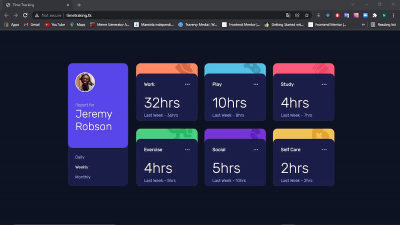
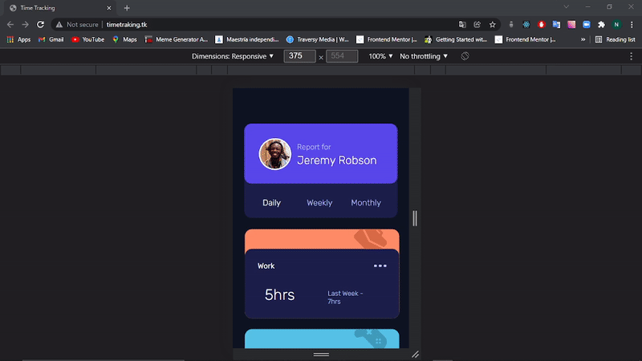

# Time tracking dashboard

Solucion para  [Time tracking dashboard challenge de Frontend Mentor](https://www.frontendmentor.io/challenges/time-tracking-dashboard-UIQ7167Jw).

## Contenido

- [Time tracking dashboard](#time-tracking-dashboard)
  - [Contenido](#contenido)
  - [Informacion general](#informacion-general)
    - [Desafio](#desafio)
    - [Screenshot](#screenshot)
    - [Links](#links)
    - [Echo con...](#echo-con)
  - [Autor](#autor)

## Informacion general

### Desafio

Los usuarios deben ser capaces de:

- Ver el diseño óptimo del sitio en función del tamaño de la pantalla de su dispositivo
- Ver el estado de los elementos interactivos de la página al pasar el ratón por encima de ellos
- Cambiar entre la visualización de las estadísticas diarias, semanales y mensuales

### Screenshot

### Links

- Solution URL: [https://www.timetraking.tk/](https://your-solution-url.com)
- Sitio URL: [https://www.timetraking.tk/](https://www.timetraking.tk/)

### Echo con...

- [React](https://reactjs.org/) - JS library
- [Create React App](https://create-react-app.dev/) - JS library
- Semantic HTML5 markup
- CSS custom properties
- Flexbox
- Mobile-first workflow
- JSON

## Autor

- Website - [Nicolas Gula](https://www.your-site.com)

